# Scholarr Mobile App

Flutter Implementation of Scholarr Mobile Application

## Screenshots

### Splash

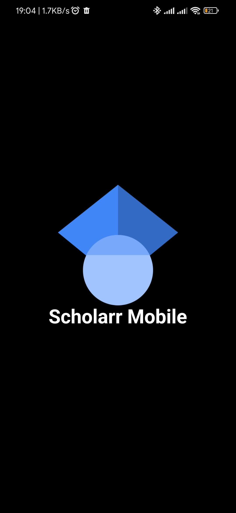

### Onboarding

|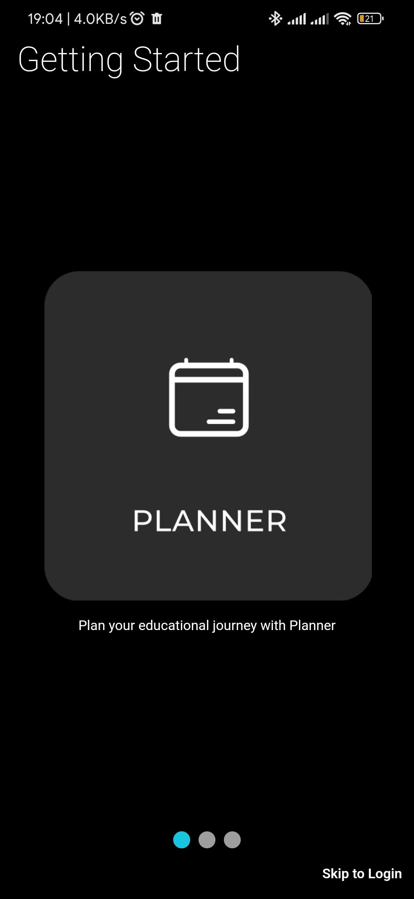|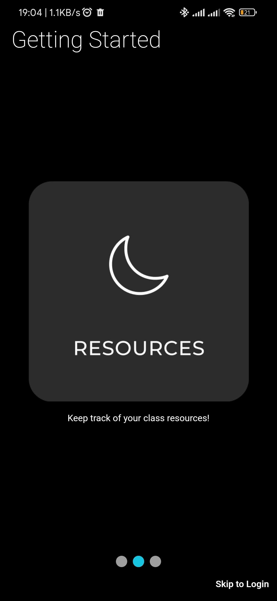|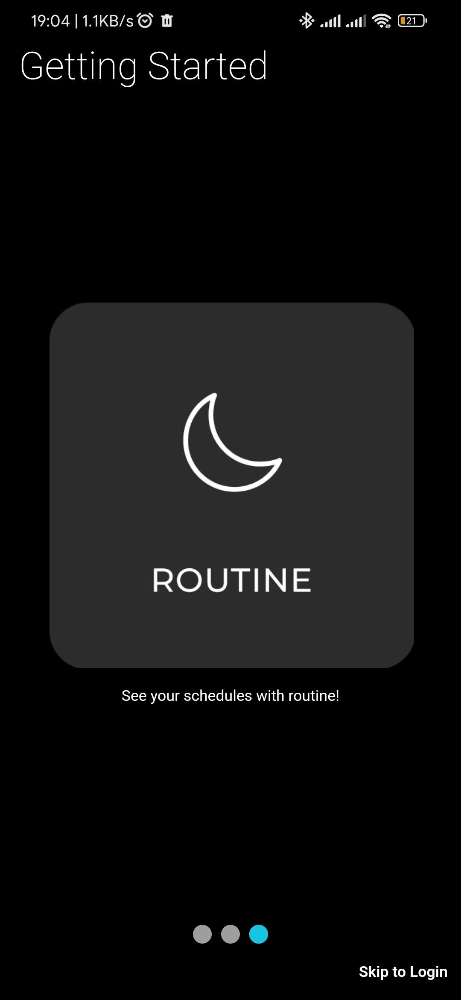|

### Authentication

|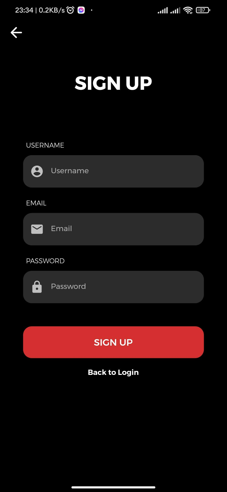|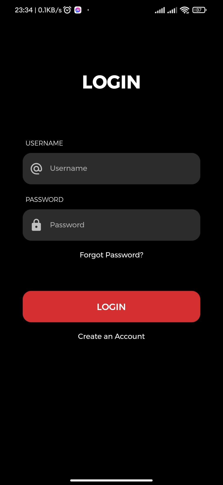||

### Authenticated

#### Navigation Menu

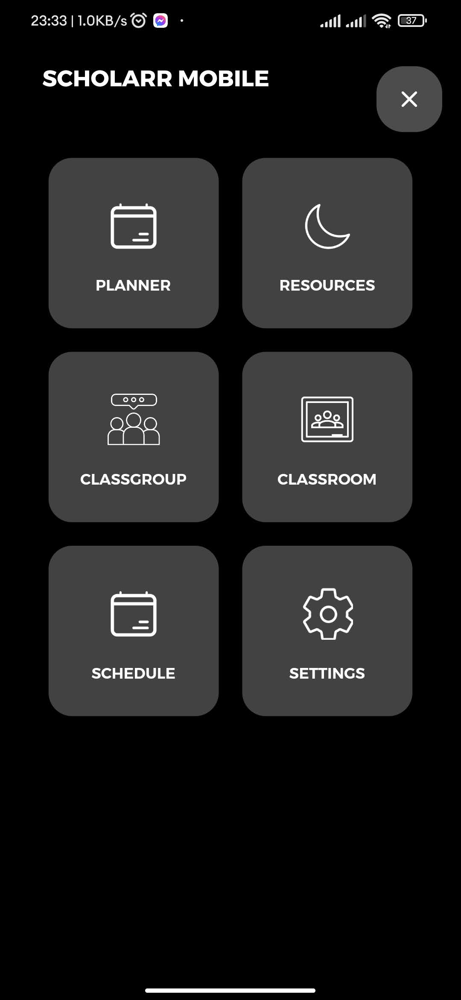

#### Classgroups

||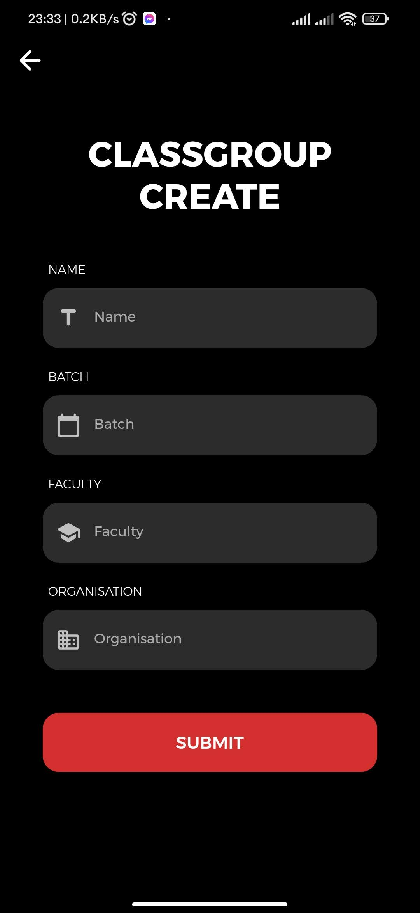|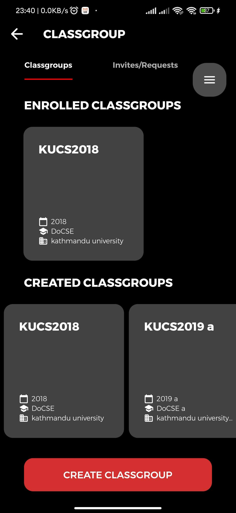|

#### Classrooms

|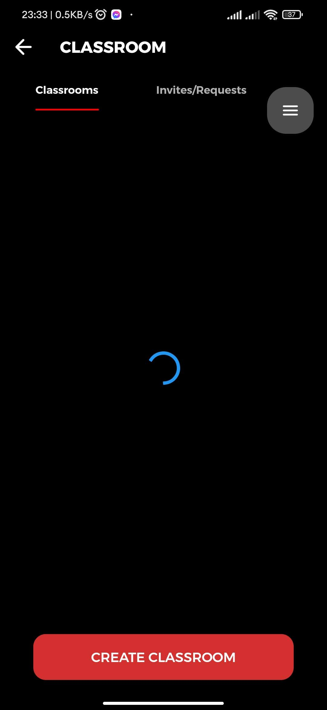|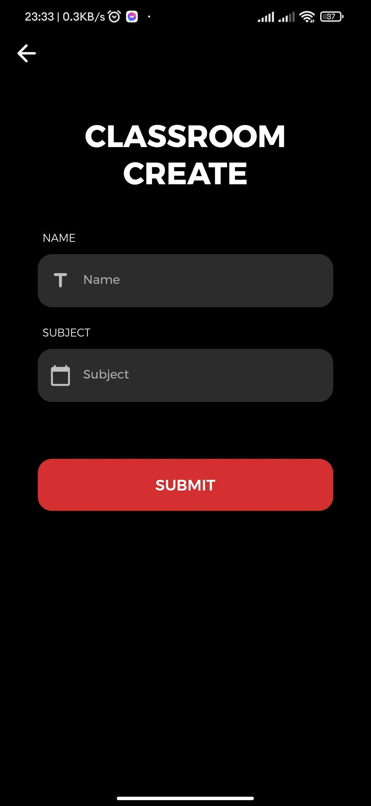|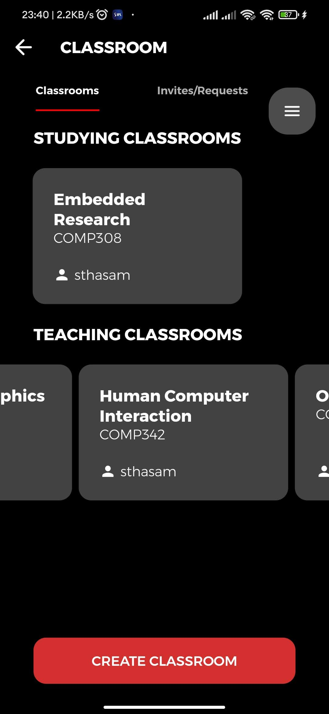|||
